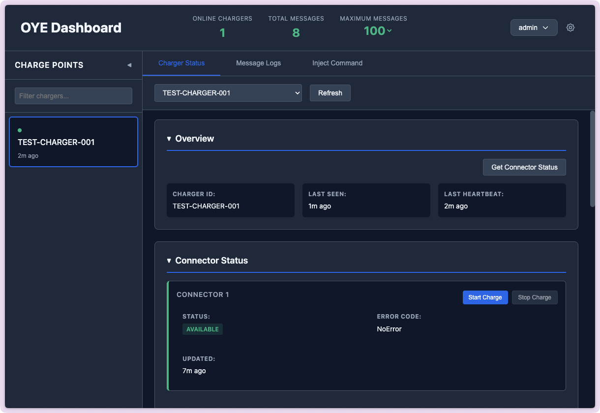

# OYE OCPP Proxy



**Own Your EVSE (OYE)** is a transparent OCPP proxy with real-time monitoring and independent EVSE control.

**Why?** EV chargers (aka EVSEs) tend to be designed for two types of users: end-users (personal or business) and charging network operators. Most charging control platforms are designed to hide the full capabilities of the charger from end-users, whether or not they own the hardware.

This utility gives control to the EVSE owner. It sits between the OCPP-capable EVSE and the control software (CSMS), allowing the owner to monitor and log communication, view real-time status, and inject their own commands or configuration via API or the built-in web console—without confusing the upstream CSMS. It can also operate in standalone mode without a backend CSMS, acting as its own basic CSMS.

**DISCLAIMER!** This tool is designed for owners of the EVSE. It should not be used with equipment you do not have the right to control. You are responsible for ensuring you understand any OCPP configuration changes you make. Changing configuration can impact the operation of the charger or upstream CSMS.

## Architecture

The proxy operates as a single-instance Node.js application running in Docker. It maintains two active WebSocket connections for every connected charger: one to the hardware, and one to the CSMS.

### Message Flow & Logic

1. **Pass-through:** Standard heartbeat, status, and meter values are logged and forwarded instantly.
2. **Auth Handling:** HTTP Basic Auth and WebSocket Protocol headers are extracted from the charger and passed to the CSMS handshake.
3. **Command Injection:** You can send OCPP commands (e.g., `RemoteStartTransaction`) via a REST API.
4. **Response Interception (The "Swallow" Logic):**
   - When the Proxy injects a command, it generates a unique Message ID.
   - When the Charger replies, the Proxy checks the ID.
   - **If it matches an injected command:** The response is logged but **NOT** forwarded to the CSMS. This prevents the CSMS from throwing errors regarding unknown message IDs.
5. **Automatic Charging (Optional):**
   - When enabled and CSMS is unavailable, the proxy can automatically approve authorization requests and start charging sessions.
   - Detects when a charger enters "Preparing" state and automatically sends `RemoteStartTransaction`.
   - Useful for offline operation or as a fallback when CSMS connectivity is lost.

## Tech Stack

- **Runtime:** Node.js (Express + `ws`)
- **Database:** SQLite (local default) or PostgreSQL (production/cloud)
- **Infrastructure:** Docker + Docker Compose
- **Protocols:** OCPP 1.6J / 2.0.1 (WebSocket)
- **Frontend:** Vanilla JavaScript (polling-based)
- **Authentication:** Basic HTTP Auth

## Prerequisites

- **Linux/macOS**: Docker and Docker Compose
- **Windows**: Docker Desktop for Windows
- (Optional) Target CSMS URL (The backend you are proxying to)

## Quick Start

The easiest way to get started is using the provided setup script:

1. **Clone the repository:**

   ```bash
   git clone https://github.com/eva-sean/oye-proxy.git
   cd oye-proxy
   ```

2. **Run the setup script:**

   **Linux/macOS:**
   ```bash
   chmod +x setup.sh
   ./setup.sh
   ```

   **Windows (PowerShell):**
   ```powershell
   .\setup.ps1
   ```

   This will:
   - Check for Docker and Docker Compose
   - Create data directories
   - Build the Docker image
   - Prompt you to create an admin user (or auto-generate one)
   - Start the proxy server

3. **Get your login credentials:**

   If you didn't create a user during setup, the proxy automatically generates a default admin account. Check the logs for the password:

   ```bash
   docker-compose logs | grep "DEFAULT ADMIN USER"
   ```

4. **Access the dashboard:**

   Open your browser and navigate to:
   ```
   http://localhost:8080
   ```

   Login with the credentials you created during setup (or the auto-generated admin credentials from the logs).

   **Important:** If using the auto-generated password, change it immediately by clicking on your username → Change Password.

The server is now running:
- **Proxy Server:** `http://localhost:8080`
- **Web Dashboard:** `http://localhost:8080/`
- **Health Check:** `http://localhost:8080/health`
- **OCPP Endpoint:** `ws://localhost:8080/ocpp/{chargePointId}`

## Manual Setup (Alternative)

If you prefer to set up manually:

**Linux/macOS:**

```bash
cp .env.example .env
mkdir -p data/db data/logs
docker-compose build
docker-compose up -d

# Check logs for auto-generated admin password
docker-compose logs | grep "DEFAULT ADMIN USER"

# Or manually create a user (optional)
docker exec -it oye-proxy node db/init.js admin yourpassword
```

**Windows (PowerShell):**

```powershell
Copy-Item .env.example .env
New-Item -ItemType Directory -Force -Path "data\db","data\logs"
docker-compose build
docker-compose up -d

# Check logs for auto-generated admin password
docker-compose logs | Select-String "DEFAULT ADMIN USER"

# Or manually create a user (optional)
docker exec -it oye-proxy node db/init.js admin yourpassword
```

**Note:** On first run, if no users exist, the proxy automatically creates an admin account with a random password displayed in the logs. Change this password immediately after first login.

## Configuration

### Proxy Settings

Configure the proxy via the web dashboard or directly in the database:

1. **Via Web Dashboard:**
   - Click the config icon (gear) in the header
   - Set the **Target CSMS URL** (e.g., `wss://your-csms.com/ocpp/`)
   - Enable **CSMS Forwarding** if you want to forward messages
   - Enable **Automatic Charging** for offline/fallback charging capabilities
   - Set **Default ID Tag** for auto-started charging sessions
   - Click **Save**

2. **Via Database:**

   ```bash
   sqlite3 data/db/oye-proxy.db
   
   UPDATE config SET value='wss://your-csms.com/ocpp/' WHERE key='targetCsmsUrl';
   UPDATE config SET value='true' WHERE key='csmsForwardingEnabled';
   UPDATE config SET value='true' WHERE key='autoChargeEnabled';
   UPDATE config SET value='ADMIN_TAG' WHERE key='defaultIdTag';
   ```

### Standalone Mode

For testing without an upstream CSMS, leave forwarding disabled. The proxy will automatically respond to:
- `BootNotification` → Accepted
- `Heartbeat` → Current time
- `Authorize` → Accepted (or IdTagInfo with status)
- `StatusNotification` → Acknowledged
- `MeterValues` → Acknowledged

### Automatic Charging

When **Automatic Charging** is enabled, the proxy can operate your chargers independently of the CSMS:

**How it works:**
1. Enable in the configuration (web dashboard or database)
2. Set a default ID tag (e.g., `ADMIN_TAG`, `FREE_CHARGING`, etc.)
3. When CSMS is unavailable or forwarding is disabled:
   - **Auto-Authorization:** All `Authorize` requests are automatically accepted
   - **Auto-Start:** When a charger status changes to "Preparing", the proxy automatically sends a `RemoteStartTransaction` command
   - Uses the configured default ID tag for all auto-started sessions

**Use cases:**
- **Offline Operation:** Run chargers without any CSMS connection
- **CSMS Failover:** Automatically start charging when upstream CSMS is down
- **Free Charging Mode:** Provide unrestricted access to your chargers
- **Development/Testing:** Test charging workflows without a full CSMS setup

**Configuration:**
- `autoChargeEnabled`: Set to `true` to enable automatic charging
- `defaultIdTag`: The RFID tag or identifier used for auto-started sessions (default: `ADMIN_TAG`)

**Note:** Auto-charging only activates when the CSMS connection is unavailable. If CSMS forwarding is enabled and the connection is active, normal authorization flows are used.

## Testing

### 1. Verify the Server is Running

**Linux/macOS:**
```bash
curl http://localhost:8080/health
```

**Windows (PowerShell):**
```powershell
Invoke-WebRequest http://localhost:8080/health
```

Expected response: `OCPP Proxy Active. Connected Chargers: 0`

### 2. Test with Emulated Charger

A test charger emulator is included for development and testing without physical hardware:

```bash
# Start the proxy
docker-compose up -d

# In a separate terminal, run the test charger
node scripts/test-charger.js

# Custom charger ID and proxy URL
CHARGE_POINT_ID=MY-CHARGER PROXY_URL=ws://192.168.1.100:8080 node scripts/test-charger.js
```

The emulator:
- Connects to the proxy via WebSocket
- Sends BootNotification and periodic Heartbeats
- Responds to all common OCPP commands (GetConfiguration, RemoteStartTransaction, RemoteStopTransaction, Reset, etc.)
- Returns realistic configuration values
- Logs all activity to console
- Auto-reconnects on disconnect

Use the web dashboard or REST API to send commands to the test charger and verify the proxy is working correctly.

### 3. Test Command Injection

Once you have a charger connected to `ws://localhost:8080/ocpp/{chargePointId}`:

```bash
curl -X POST http://localhost:8080/api/inject/your-charger-id \
  -u admin:yourpassword \
  -H "Content-Type: application/json" \
  -d '{
    "action": "RemoteStartTransaction",
    "payload": {
      "connectorId": 1,
      "idTag": "TEST_TAG"
    }
  }'
```

Expected response:
```json
{
  "status": "sent",
  "messageId": "a1b2c3d4-..."
}
```

### 4. Monitor Logs

Check the database to verify messages are being logged:

```bash
sqlite3 data/db/oye-proxy.db "SELECT * FROM logs ORDER BY timestamp DESC LIMIT 10;"
(For PostgreSQL, use psql or your preferred client)
```

Or use the web dashboard to see real-time message flow with these directions:
- `UPSTREAM`: Messages from charger to CSMS
- `DOWNSTREAM`: Messages from CSMS to charger
- `INJECTION_REQUEST`: Commands sent via REST API
- `INJECTION_RESPONSE`: Charger responses to injected commands (not forwarded to CSMS)
- `PROXY_RESPONSE`: Automatic responses when CSMS is unavailable

## Management

### View Logs

```bash
# Container logs
docker-compose logs -f

# Application logs
tail -f data/logs/oye-proxy.log
```

### Restart Proxy

```bash
docker-compose restart
```

### Stop Proxy

```bash
docker-compose down
```

### Backup Database

```bash
cp data/db/oye-proxy.db data/db/oye-proxy.db.backup-$(date +%Y%m%d)
```

### Add New Users

```bash
docker exec -it oye-proxy node db/init.js newuser newpassword
```

### Manual Log Cleanup

```bash
docker exec -it oye-proxy node scripts/cleanup.js
```

## Web Dashboard

The proxy includes a real-time web dashboard for monitoring and controlling chargers.

### Features

- **Real-time Message Monitoring**: Watch OCPP messages flow between chargers and CSMS (5-second polling)
- **Charger Status**: See online/offline status of all connected charge points
- **Command Injection**: Send OCPP commands via web interface
- **Message Filtering**: Filter by charger and message limit
- **Proxy Configuration**: Update CSMS URL, forwarding settings, and automatic charging options
- **Automatic Charging Control**: Enable/disable auto-charging and configure default ID tags
- **Basic Authentication**: Secure access with username/password

### Access

Navigate to `http://localhost:8080` in your browser. On first visit, you'll be prompted to log in with credentials created during setup (or the auto-generated admin credentials if no user was created).

## API Reference

All endpoints except health check require Basic Authentication.

### Health Check

```http
GET /
```

Returns the count of currently connected chargers.

### Get Logs

```http
GET /api/logs?chargePointId={cpId}&limit={n}&since={timestamp}
Authorization: Basic {base64(username:password)}
```

### Get Chargers

```http
GET /api/chargers
Authorization: Basic {base64(username:password)}
```

### Get Config

```http
GET /api/config
Authorization: Basic {base64(username:password)}
```

### Update Config

```http
POST /api/config
Authorization: Basic {base64(username:password)}
Content-Type: application/json

{
  "targetCsmsUrl": "wss://example.com/ocpp/",
  "csmsForwardingEnabled": true,
  "autoChargeEnabled": false,
  "defaultIdTag": "ADMIN_TAG"
}
```

**Parameters:**
- `targetCsmsUrl` (string): WebSocket URL of upstream CSMS
- `csmsForwardingEnabled` (boolean): Enable/disable message forwarding to CSMS
- `autoChargeEnabled` (boolean): Enable/disable automatic charging when CSMS is unavailable
- `defaultIdTag` (string): ID tag used for auto-started charging sessions

### Command Injection

```http
POST /api/inject/{chargePointId}
Authorization: Basic {base64(username:password)}
Content-Type: application/json

{
  "action": "RemoteStartTransaction",
  "payload": {
    "connectorId": 1,
    "idTag": "ADMIN_OVERRIDE_TAG"
  }
}
```

**Response:**

```json
{
  "status": "sent",
  "messageId": "a1b2c3d4-..."
}
```

## Data Model

### Table: `logs`

Stores every message passed through the proxy.

- `id`: INTEGER PRIMARY KEY
- `charge_point_id`: TEXT
- `direction`: TEXT ('UPSTREAM', 'DOWNSTREAM', 'INJECTION_REQUEST', 'INJECTION_RESPONSE', 'PROXY_RESPONSE')
- `payload`: TEXT (JSON string)
- `timestamp`: INTEGER (Unix timestamp)

### Table: `chargers`

Stores the current state of devices.

- `charge_point_id`: TEXT PRIMARY KEY
- `status`: TEXT ('ONLINE', 'OFFLINE')
- `last_seen`: INTEGER (Unix timestamp)

### Table: `config`

Stores proxy configuration.

- `key`: TEXT PRIMARY KEY
- `value`: TEXT
- `updated_at`: INTEGER (Unix timestamp)

Configuration keys:
- `targetCsmsUrl`: WebSocket URL of upstream CSMS
- `csmsForwardingEnabled`: 'true' or 'false'
- `autoChargeEnabled`: 'true' or 'false' - Enable automatic charging when CSMS unavailable
- `defaultIdTag`: String - ID tag used for auto-started charging sessions
- `port`: Server port number

### Table: `auth_users`

Stores authentication credentials.

- `username`: TEXT PRIMARY KEY
- `password_hash`: TEXT (SHA-256)
- `created_at`: INTEGER (Unix timestamp)

## Log Cleanup

A cron job automatically cleans up old logs to prevent unbounded growth:

- **Schedule**: Daily at 2 AM UTC
- **Retention**: 1000 most recent logs per charger (configurable via `LOG_RETENTION_COUNT` env var)
- **Startup**: Also runs once on container startup

The cleanup process keeps the newest logs for each charger and batch-deletes older entries.

## Charger Configuration

Point your EV chargers to:

```
ws://your-server-ip:8080/ocpp/{chargePointId}
```

Or for WebSocket Secure (requires nginx):

```
wss://your-server-ip/ocpp/{chargePointId}
```

Replace `{chargePointId}` with your charger's unique identifier.

## Updating

To update after code changes:

```bash
docker-compose down
git pull
docker-compose build
docker-compose up -d
```

## Troubleshooting

See [DEPLOYMENT.md](DEPLOYMENT.md) for detailed troubleshooting guide.

Common issues:
- **Authentication failed**: Reset password with `docker exec -it oye-proxy node db/init.js username newpassword`
- **Chargers not connecting**: Check firewall rules (`sudo ufw allow 8080/tcp`)
- **Database locked**: Stop container, remove lock files, restart

## Security

- **Change auto-generated admin password immediately** after first login (username dropdown → Change Password)
- Use strong passwords (minimum 8 characters required, 16+ recommended)
- Set up nginx with SSL/TLS for production
- Limit port access to known charger IPs
- Regular backups of the database
- Monitor logs for unauthorized access
- Delete or disable unused user accounts

## Limitations

1. **Scaling:** This architecture stores socket references in memory and cannot scale horizontally without adding Redis/external state store.
2. **SQLite Concurrency:** Limited write concurrency (uses WAL mode for better performance).
3. **In-Memory ID Tracking:** Restarting the server loses pending injection IDs.

## Acknowledgments

This project was developed with assistance from [Claude](https://claude.ai), an AI assistant by Anthropic.

## License

MIT License - see [LICENSE](LICENSE) file for details.

Copyright (c) 2025 EV Angels Inc.
